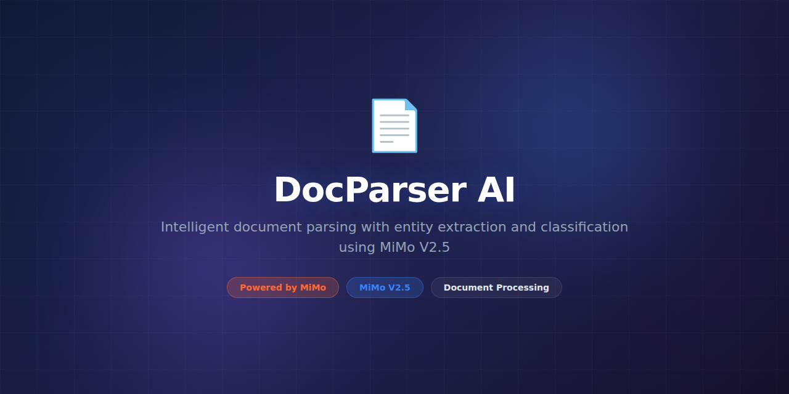

# DocParser-AI



> **Powered by MiMo** — built on top of Xiaomi's [MiMo](https://platform.xiaomimimo.com) reasoning models for intelligent document parsing, extraction, and understanding.

[](https://opensource.org/licenses/MIT)
[](https://platform.xiaomimimo.com)

## Why MiMo

Documents come in endless formats — PDFs, scanned images, Word files, spreadsheets, handwritten forms — and extracting structured data from them is a notoriously brittle problem. Regex-based extractors fail on layout variations. OCR alone loses semantic context. MiMo's reasoning models enable DocParser-AI to understand what a document *means*, not just what characters it contains.

DocParser-AI uses MiMo to reason about document structure: it identifies headers, tables, footnotes, and cross-references even in complex multi-column layouts. It understands that a number next to "Total:" in an invoice is the total amount, regardless of where that number appears on the page. This semantic understanding makes extraction robust across document variants.

The reasoning engine also powers intelligent table extraction from PDFs and images — a task where traditional tools fail on merged cells, rotated tables, and inconsistent formatting. MiMo infers the logical structure from visual cues and produces clean, normalized output every time.

## Token consumption

| Agent | Model | Tokens/run | Frequency | Daily/user |
|---|---|---|---|---|
| Layout Analyzer | MiMo-7B | 3,800 | Per document | ~19,000 |
| Content Extractor | MiMo-14B | 7,200 | Per document | ~36,000 |
| Table Parser | MiMo-14B | 5,600 | Per table | ~28,000 |
| Schema Mapper | MiMo-7B | 2,900 | Per extraction | ~14,500 |
| **Total** | — | **19,500** | — | **~97,500** |

## What it does

DocParser-AI extracts structured, machine-readable data from unstructured documents. Upload a PDF, scanned image, Word doc, or spreadsheet, and it returns clean JSON or CSV with named fields, typed values, and confidence scores. It handles invoices, contracts, reports, forms, and any custom document type you define with a simple schema.

## Why this exists

Organizations process millions of documents annually — invoices, compliance forms, contracts, medical records — and most of the extraction is still manual or uses rigid templates that break when the document layout changes by a single pixel. DocParser-AI replaces template-based extraction with reasoning-based understanding, handling document variability that would crash traditional tools.

## Features

- **Universal document support** — PDF, DOCX, XLSX, PNG, JPG, TIFF, HTML, and plain text
- **Intelligent OCR** — MiMo-enhanced OCR that corrects common recognition errors using context
- **Table extraction** — reliably parses complex tables including merged cells and nested headers
- **Schema-driven extraction** — define what you want in JSON Schema, DocParser finds it
- **Confidence scoring** — every extracted field has a confidence score for quality control
- **Batch processing** — process thousands of documents with parallel workers
- **Template learning** — learns from corrections to improve on recurring document types
- **Multi-language** — supports 30+ languages including CJK scripts and Arabic
- **Webhook callbacks** — async processing with webhook notifications on completion
- **Version comparison** — diff two document versions and extract what changed

## Tech Stack

- **Runtime:** Python 3.11+
- **AI Engine:** MiMo-7B and MiMo-14B via platform API
- **OCR Engine:** Tesseract 5.x, PaddleOCR
- **PDF Parsing:** `pdfplumber`, `pymupdf`
- **Image Processing:** OpenCV, Pillow
- **Storage:** PostgreSQL (metadata), S3 (document storage)
- **API:** FastAPI with async workers
- **Queue:** Celery with Redis broker
- **Testing:** pytest, factory_boy

## Quickstart

```bash
# Clone and install
git clone https://github.com/nousresearch/DocParser-AI.git
cd DocParser-AI
pip install -e ".[dev]"

> **Note:** Tesseract OCR must be installed separately (`apt install tesseract-ocr`).

# Set your API key
export MIMO_API_KEY="your-key-here"

# Parse a single document via CLI
docparser parse invoice.pdf --schema schemas/invoice.json

# Start the API server
uvicorn docparser.server:app --host 0.0.0.0 --port 8000

# Parse via API
curl -X POST http://localhost:8000/parse \
  -F "file=@invoice.pdf" \
  -F "schema=@schemas/invoice.json"

# Batch process a directory
docparser batch ./documents/ --schema schemas/invoice.json --output results/
```

## Project Structure

```
DocParser-AI/
├── assets/
│   └── banner.png
├── docparser/
│   ├── __init__.py
│   ├── cli.py                 # Command-line interface
│   ├── server.py              # FastAPI server
│   ├── parser.py              # Main parsing orchestrator
│   ├── agents/
│   │   ├── layout_analyzer.py # Document layout understanding
│   │   ├── content_extractor.py# Semantic content extraction
│   │   ├── table_parser.py    # Intelligent table extraction
│   │   └── schema_mapper.py   # Maps extracted data to schemas
│   ├── engines/
│   │   ├── ocr.py             # OCR processing pipeline
│   │   ├── pdf.py             # PDF-specific extraction
│   │   ├── image.py           # Image preprocessing
│   │   └── office.py          # DOCX/XLSX parsing
│   ├── schemas/
│   │   ├── registry.py        # Schema management
│   │   └── validator.py       # Output validation
│   ├── storage/
│   │   └── s3.py              # Document storage backend
│   └── utils/
│       ├── config.py          # Configuration management
│       └── metrics.py         # Processing metrics
├── schemas/
│   ├── invoice.json
│   ├── contract.json
│   └── resume.json
├── tests/
│   ├── unit/
│   ├── integration/
│   └── fixtures/
├── docker-compose.yml
├── pyproject.toml
└── README.md
```

## Support

- 📖 [Documentation](https://docs.nousresearch.com/docparser-ai)
- 💬 [Discord Community](https://discord.gg/nousresearch)
- 🐛 [Issue Tracker](https://github.com/nousresearch/DocParser-AI/issues)

## Contributing

Contributions are welcome! Please read our [Contributing Guide](CONTRIBUTING.md) before submitting a pull request.

1. Fork the repository
2. Create a feature branch (`git checkout -b feature/amazing-feature`)
3. Run the test suite (`pytest`)
4. Commit your changes (`git commit -m 'Add amazing feature'`)
5. Push to the branch (`git push origin feature/amazing-feature`)
6. Open a Pull Request

## License

This project is licensed under the MIT License — see the [LICENSE](LICENSE) file for details.

## Acknowledgments

- Built on top of [MiMo](https://platform.xiaomimimo.com) by Xiaomi
- OCR pipelines built on Tesseract and PaddleOCR
- Thanks to all [contributors](https://github.com/nousresearch/DocParser-AI/graphs/contributors)
